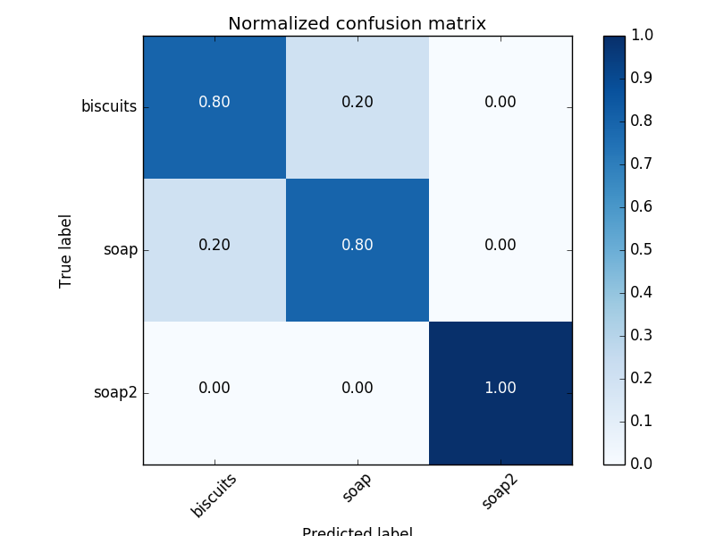
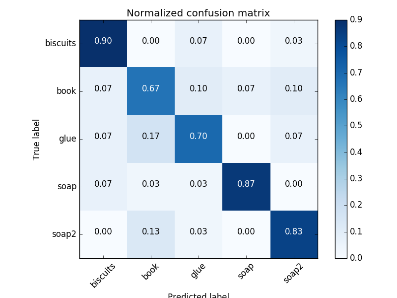
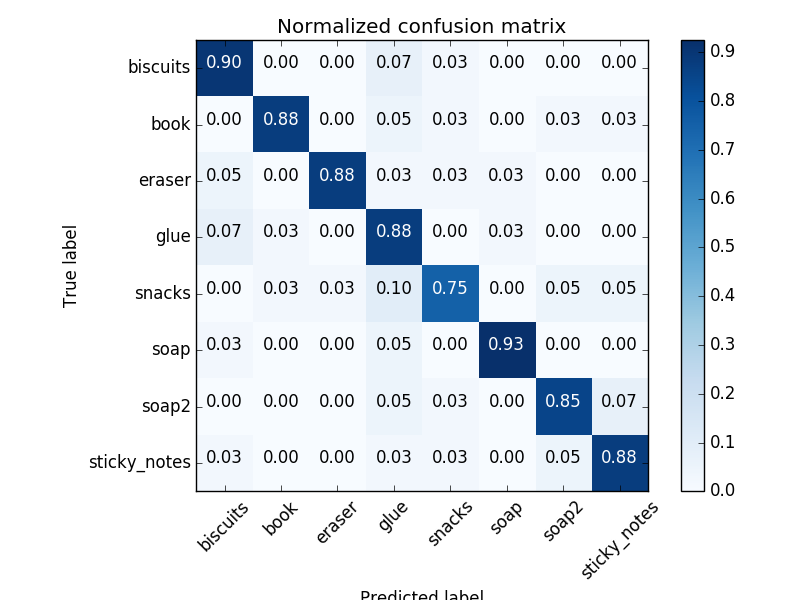
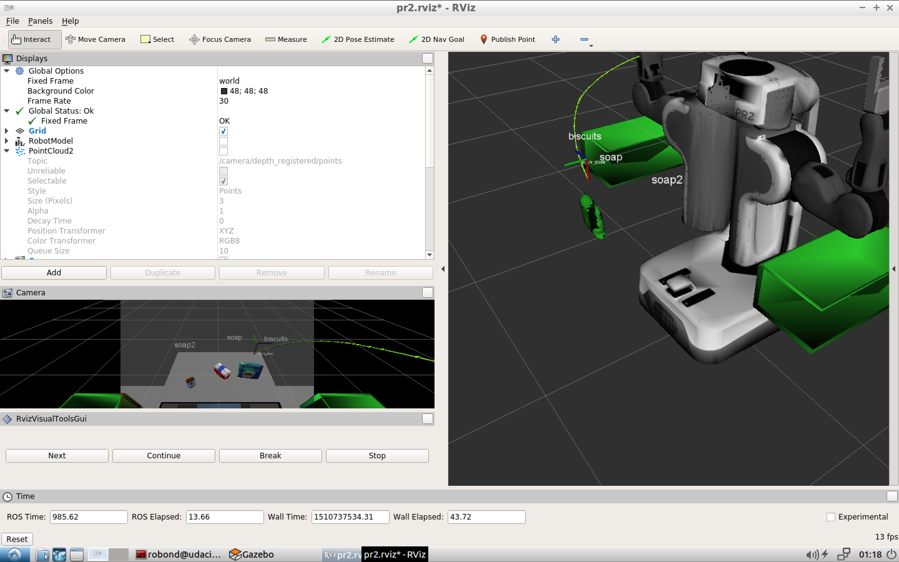
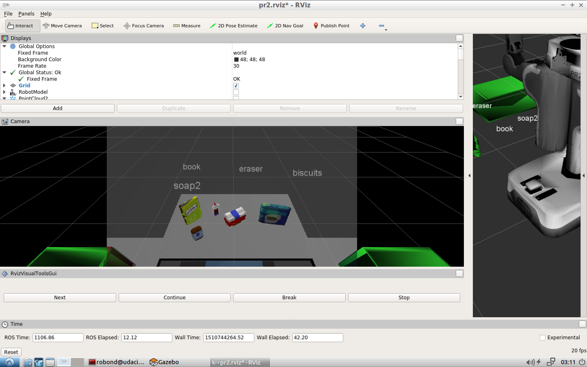
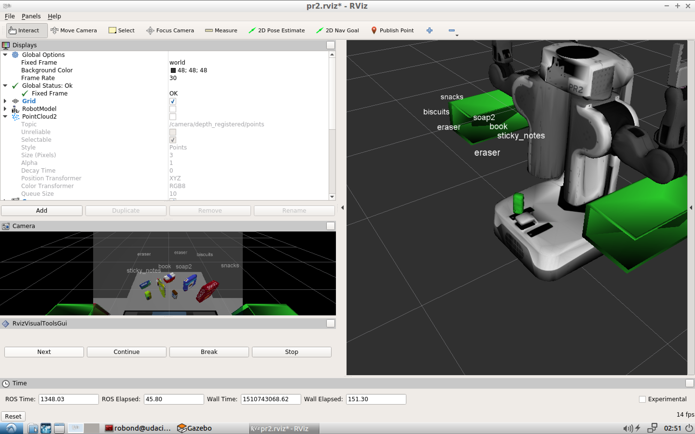

## Project: Perception Pick & Place
### Writeup Template: You can use this file as a template for your writeup if you want to submit it as a markdown file, but feel free to use some other method and submit a pdf if you prefer.

---

# Required Steps for a Passing Submission:
1. Extract features and train an SVM model on new objects (see `pick_list_*.yaml` in `/pr2_robot/config/` for the list of models you'll be trying to identify). 
2. Write a ROS node and subscribe to `/pr2/world/points` topic. This topic contains noisy point cloud data that you must work with.
3. Use filtering and RANSAC plane fitting to isolate the objects of interest from the rest of the scene.
4. Apply Euclidean clustering to create separate clusters for individual items.
5. Perform object recognition on these objects and assign them labels (markers in RViz).
6. Calculate the centroid (average in x, y and z) of the set of points belonging to that each object.
7. Create ROS messages containing the details of each object (name, pick_pose, etc.) and write these messages out to `.yaml` files, one for each of the 3 scenarios (`test1-3.world` in `/pr2_robot/worlds/`).  [See the example `output.yaml` for details on what the output should look like.](https://github.com/udacity/RoboND-Perception-Project/blob/master/pr2_robot/config/output.yaml)  
8. Submit a link to your GitHub repo for the project or the Python code for your perception pipeline and your output `.yaml` files (3 `.yaml` files, one for each test world).  You must have correctly identified 100% of objects from `pick_list_1.yaml` for `test1.world`, 80% of items from `pick_list_2.yaml` for `test2.world` and 75% of items from `pick_list_3.yaml` in `test3.world`.
9. Congratulations!  Your Done!

# Extra Challenges: Complete the Pick & Place
7. To create a collision map, publish a point cloud to the `/pr2/3d_map/points` topic and make sure you change the `point_cloud_topic` to `/pr2/3d_map/points` in `sensors.yaml` in the `/pr2_robot/config/` directory. This topic is read by Moveit!, which uses this point cloud input to generate a collision map, allowing the robot to plan its trajectory.  Keep in mind that later when you go to pick up an object, you must first remove it from this point cloud so it is removed from the collision map!
8. Rotate the robot to generate collision map of table sides. This can be accomplished by publishing joint angle value(in radians) to `/pr2/world_joint_controller/command`
9. Rotate the robot back to its original state.
10. Create a ROS Client for the “pick_place_routine” rosservice.  In the required steps above, you already created the messages you need to use this service. Checkout the [PickPlace.srv](https://github.com/udacity/RoboND-Perception-Project/tree/master/pr2_robot/srv) file to find out what arguments you must pass to this service.
11. If everything was done correctly, when you pass the appropriate messages to the `pick_place_routine` service, the selected arm will perform pick and place operation and display trajectory in the RViz window
12. Place all the objects from your pick list in their respective dropoff box and you have completed the challenge!
13. Looking for a bigger challenge?  Load up the `challenge.world` scenario and see if you can get your perception pipeline working there!

## [Rubric](https://review.udacity.com/#!/rubrics/1067/view) Points
### Here I will consider the rubric points individually and describe how I addressed each point in my implementation.  

---
### Writeup / README

#### 1. Provide a Writeup / README that includes all the rubric points and how you addressed each one.  You can submit your writeup as markdown or pdf.  

You're reading it!

### Exercise 1, 2 and 3 pipeline implemented

I completed steps 1, 2, and 3 by moving code from the perception exercises and didn't take a look until the Project Rubric until after I had these sections working. As a result, I don't have any intermediate pictures. 

#### 1. Complete Exercise 1 steps. Pipeline for filtering and RANSAC plane fitting implemented.

#### 2. Complete Exercise 2 steps: Pipeline including clustering for segmentation implemented.  

I experimented with clustering parameters and settled on the values in the code to constrain the segmentation algorithm. 

#### 2. Complete Exercise 3 Steps.  Features extracted and SVM trained.  Object recognition implemented.

In the first two worlds, I captured 30 samples for each object, used HSV for the color histogram, and used a bucket size of 64 for both color and normal histograms. In the last one, I captured 40 samples and dropped the bucket size for color histograms from 64 to 32.

Features in Training Set: 15
Invalid Features in Training set: 0
Scores: [ 0.66666667  1.          0.66666667  1.          1.        ]
Accuracy: 0.87 (+/- 0.33)
accuracy score: 0.866666666667

Features in Training Set: 150 
Invalid Features in Training set: 0
Scores: [ 0.76666667  0.83333333  0.86666667  0.76666667  0.73333333]
Accuracy: 0.79 (+/- 0.10)
accuracy score: 0.793333333333

Features in Training Set: 320
Invalid Features in Training set: 0
Scores: [ 0.8125    0.828125  0.90625   0.859375  0.921875]
Accuracy: 0.87 (+/- 0.09)
accuracy score: 0.865625

Normalized confusion matrix for world 1:

NCM for world 2:

NCM for world 3:

### Pick and Place Setup

#### 1. For all three tabletop setups (`test*.world`), perform object recognition, then read in respective pick list (`pick_list_*.yaml`). Next construct the messages that would comprise a valid `PickPlace` request output them to `.yaml` format.

World 1 object recognition:

World 2 object recognition:

World 3 object recognition:

I would improve this project by making the robot look side to side and cover more table areas, such as in world 4. 

